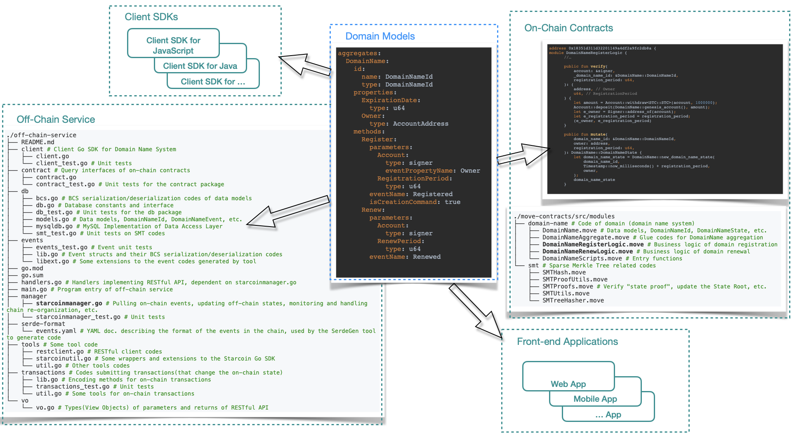

# dddappp: A Domain-Driven DAPP low-code development Platform

English | [中文](README_CN.md)

[ToC]

## Our vision

Our goal is to create a **true** low-code development platform (LCDP) that allows developers to easily build highly complex decentralized applications (Dapps).

We believe that blockchain is a revolutionary technical infrastructure that can support innovative decentralized applications. We hope that through our low-code development platform, developers can fully leverage the advantages of blockchain without worrying about the underlying technical details.

Our platform adapts to both current needs and future possibilities. Developers are not limited by any specific programming language or blockchain platform, they only need to focus on implementing the "business logic". In this way, whether it is complex "traditional" enterprise software or Web2 internet applications, they can easily transform into decentralized Web3 applications.

### What is a "true" low-code development platform

In fact, there is already a relatively unified evaluation standard for what is a low-code development platform in the industry.

If you think that "low-code" means "the less human-written code, the better, preferably no code at all", or if you think that "the best low-code platform is a no-code platform", then you are very wrong.

Here we need to clarify a common misconception, which is the confusion between "low-code" and "no-code".

* "No-code" refers to a large category (without a unified standard) of tools for "end users" (i.e., non-technical people). They allow users to create some simple applications by dragging, selecting, filling in blanks and other simple operations, such as product advertising pages, online surveys, personal blogs, etc.

* "Low-code" development platforms are tools that provide services for professional developers. They allow developers to use model-driven, visual interfaces, predefined components, automated processes and other features to build more complex and powerful applications.

We believe (and it is also widely recognized in the industry) that a true low-code development platform should have the following key features:

* **Model driven** development. This means that developers can use a "domain model" that is closer to "business" rather than "technology" to describe the application they want to build. This can greatly reduce communication costs and understanding difficulties, and improve collaboration efficiency.

* **Visual Development**. This means that developers can use some visual modeling tools to create and modify domain models without writing complex code. If necessary, they can also directly edit the plain text files corresponding to the domain models, which means that these files need to follow a DSL (domain-specific language) specification.

* Support the use of **expression languages**. This means that developers can use an expression language that is simpler and easier to write business logic than general-purpose programming languages. This language should be functional and declarative, i.e., only expressing "what is wanted" rather than "how it is done".

* **Systematic software engineering support**. This means that the low-code development platform should integrate best practices in software engineering areas such as development, debugging, testing, version control, DevOps, etc., so that developers can focus more on the functionality and quality of the application without worrying about technical details and operational issues.

* **Open integration and extensibility**. This means that the low-code development platform should provide open APIs so that developers can use external services and data, as well as allow external applications and systems to use the applications built by the low-code development platform. At the same time, the low-code development platform should also allow developers to use general-purpose programming languages for extension to meet some special needs.

We believe that such a "true" low-code development platform has not yet appeared in the decentralized world. We have the confidence and ability to create it.

## Our value

We firmly believe that low-code development platforms are the future trend of blockchain application development. They can enable developers to quickly and easily build high-quality Dapps without worrying about the underlying technical details. They can also attract more "traditional" application developers to enter the blockchain field, using their knowledge and experience accumulated in various industries and domains, to create more valuable and meaningful Dapps.

In the initial stage, our low-code development platform will support Dapp development based on various Move platforms.

### Why we start with Move language

We love blockchain technology, especially the revolutionary innovation of "resource-oriented programming" in the Move language. We believe that the combinability of resources can greatly accelerate the innovation in the Move ecosystem, and thus foster some killer applications that are hard to achieve on other blockchains.

But we also realize that there are still many challenges and pain points in blockchain application development. Even with the Move language, developing a slightly complex Dapp still requires a lot of time and effort, as well as mastering different technology stacks and tools. That's why we want to create a low-code development platform that makes Move application development simpler and more efficient.

### Provide support for DAOs

We especially want to emphasize the huge imagination space that can be raised by the combination of low-code platforms and DAOs (decentralized autonomous organizations). DAOs are "legal persons" that exist in the blockchain world, which can achieve some efficiency and transparency that traditional organizations can hardly reach. Obviously, DAOs need more "business activities" to be on-chain, which requires more support from blockchain "business software". Low-code development platforms can enable DAO creators and participants to easily build Dapps that meet their needs and visions, and also allow them to modify and optimize them at any time.

Traditional low-code development platforms have already proven their advantages in rapid development of traditional "enterprise applications", and we believe this will be the case in the Web3 era.

---

## Current state of low-code development platforms

When we look at traditional low-code development platforms for enterprise applications in the Web 2.0 era according to the above criteria for "true" low-code, there are relative leaders.

So, by the time of Web 3.0, the existing Dapp low-code platforms(if they exist at all), are there any very capable ones?

Unfortunately, by the rigorous "true" low-code criteria described above, we have not yet seen the existence of such a Dapp low-code platform.

"Is it so hard? Why don't they do it?"

### The “model-driven” of enterprise application LCDPs

Traditional enterprise application development platforms(including low-code platforms) are basically "driven" by the E-R(Entity-Relationship) models and/or relational models(the models used in SQL databases).

For example, see how OutSystems does it?

OutSystems uses both E-R models and relational(data) models; some enterprise application development platforms use only one or the other.

There is a fairly direct correspondence between the concepts used by the E-R models and the relational models, so their modeling results(the generated codes) can easily run on the traditional enterprise software technology infrastructures - SQL databases. But it's hard for them to run on brand new technology infrastructures such as blockchains - where the dominant smart contract platforms and "decentralized ledgers" are constructed too far from traditional SQL databases.

Clearly, the development of a "true" low-code platform requires long-term accumulation of skills and experience, and the technology routes used in traditional enterprise application low-code platforms make them difficult to be ported to the entirely new space of Dapp development.

As for the existing Dapp "low-code" platforms, "They don't have those features, but then what does it matter?"

### The importance of core values

The development of a true low-code - especially adhering to model-driven - is a hard way to go. The problem with existing Dapp “low-code” platforms is that they always try to take shortcuts.

> Never forget the original intention, the only way to get to the end.

A platform's potential is determined by its "core values". The core features expected of a professional low-code platform, such as model-driven, expression language, have values that are difficult to replace with other solutions that try to "bypass" them.

For example, "configurable smart contract templates" certainly have the value of improving the efficiency of developers copying, pasting, and modifying "readymade codes" - if indeed there are "readymade codes". If a developer wants to make some innovative applications and there are no readymade "smart contract templates" available, then it won't be helpful; when multiple chains need to be supported, it is also a big burden for platform developers to write and maintain such a library of "smart contract templates" in different languages(Solidity, Move, etc.) for different chains. Moreover, "smart contracts" are often only the on-chain part of an application, and decentralized applications often require off-chain parts as well.

There is also the "expression language", and although it may be difficult to implement this feature perfectly(the implementation priority can be lower) - for example, it requires developing compilers to compile the codes written in this expression language into instructions that can be executed by the virtual machines(EVM, MoveVM, etc.) of each chain - with it, developers can use only this "expression language" to write business logic, and the developed application can run directly on different chains. There is no need to learn and use each chain's programming language, which greatly saves the cost of application development and porting.

## Technology architecture overview

"Model-driven development" is the core feature of low-code development platforms.

As mentioned earlier, the traditional models used by low-code platforms for enterprise applications are relational and/or ER models; We choose the DDD([Domain-Driven Design](https://en.wikipedia.org/wiki/Domain-driven_design)) style domain models, which makes our platform so unique and powerful.

### The key is the modeling paradigm

The DDD domain models are OO(object-oriented) models in a relatively high level of abstraction.

Mapping from the higher abstraction level DDD domain models to the lower abstraction level implementation object models(OO is the dominant paradigm for programming languages), relational models(the dominant paradigm for database models), etc. is relatively easy and can often be done by automated tools.

Mapping low-level models to each other is relatively difficult and often requires developers to step in and even write a lot of implementation codes.
Developers familiar with the ORM(Object-Relational Mapping) frameworks can easily understand this.

### Domain models as the core

The idea is that there should be a domain modeling language that can be used to accurately describe key concepts in the domain; the domain models described by this language can be used as the basis for communication across the application development team(both technical and domain experts) and should be conveniently mapped to the code implementation of the application.

This language should be a DSL that can be adopted by visualization tools as well as easy for humans to read and write.

With the domain models described by this DSL as the core, we make a toolchain to generate the implementation codes for various parts of applications from models and then run the applications on various technical infrastructures.

### Domain-Driven Design Modeling Language(DDDML)

The question is whether we can find such a language as described above?

Fortunately we have found it - DDDML(Domain-Driven Design Modeling Language); more precisely, we invented it.

Eric Evans, founder of Domain-Driven Design, has said that he has always believed that DSL is the next big step in the evolution of domain-driven design.

DDDML takes this big solid step forward. You will see this in what follows.

## Who we are

"Theoretically you are all right, but why can you do it?"

Because, "using DDD-style domain models to drive development" is really the thing we've done in the Web 2.0 era!

Even when implementing a low-code platform for developing traditional enterprise applications, using DDD-style domain models to drive development is a very bold and innovative move. But the path is through, we have had a lot of valuable experience accumulated. We even published a thick monograph to share the lessons learned with developers.

Here it is necessary to highlight the architect of our project: Jiefeng Yang. He has more than 20 years of software development experience, and is a well-deserved DDD expert, the creator of DDDML, and the author of the technical book "[Deep into DDD: Driving Complex Software Development by DSL](https://item.jd.com/12834017.html)". He is also one of the developers of, or has provided key technical support for, several important ecological fundamental projects on Starcoin, the first Move public blockchain(some ecological projects on Starcoin are developed by anonymous teams). 

It is in the book "Deep into DDD" that we detail the design of DDDML, the native DSL for DDD, and its related development toolchain, and how to use them to solve various aches in complex software development processes. This well-received bestseller was published in April 2021 and reprinted in September of the same year.

That is, we have completed the construction of a complete theoretical system of key technologies that we have successfully put into practice; more than that, we have done a preliminary proof of concept on how to apply these experiences to the development of Dapps - as we will demonstrate in a demo system below.

## Deliverables

> 🎉 This project is one of the first round grant recipients of the Sui Foundation (the first one listed): https://sui.io/resources-sui/sui-foundation-round-1-awardees/ 🎉

This is certainly an ambitious project, but it doesn't make too much sense to discuss longer-term plans; we started by setting two small milestones for the project.

### Milestone I

We will create a command line tool or a set of tools. At a minimum, the tool will help developers generate on-chain Move contracts (the on-chain part of a Dapp), off-chain services (written in Java or Go), and even more from domain models, such as Client JavaScript SDKs, scaffolding codes of web front-end applications with user interfaces, etc.

It is expected that this milestone can be reached by two persons working for three months after the project starts.

### Milestone II

We will move the functionality of the command line tools created in Milestone I to the cloud, where developers can simply open their browsers and use them. We expect to provide a simple Web IDE for developers to write domain models, generate Dapp applications "with one click", write business logic codes, and deploy the applications to a test environment in the cloud.

It is expected that after reaching the first milestone, two persons working for three months can reach this second milestone.

