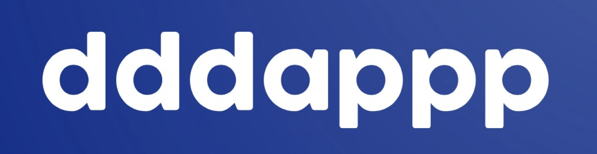
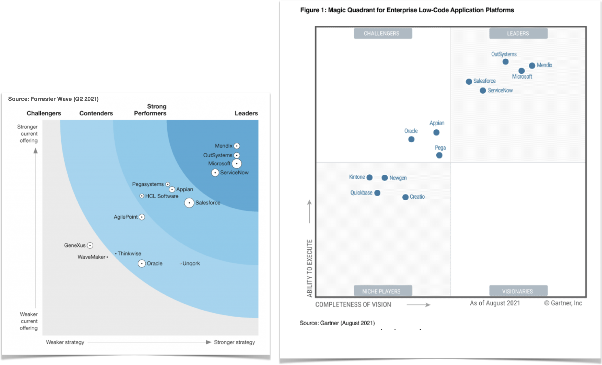
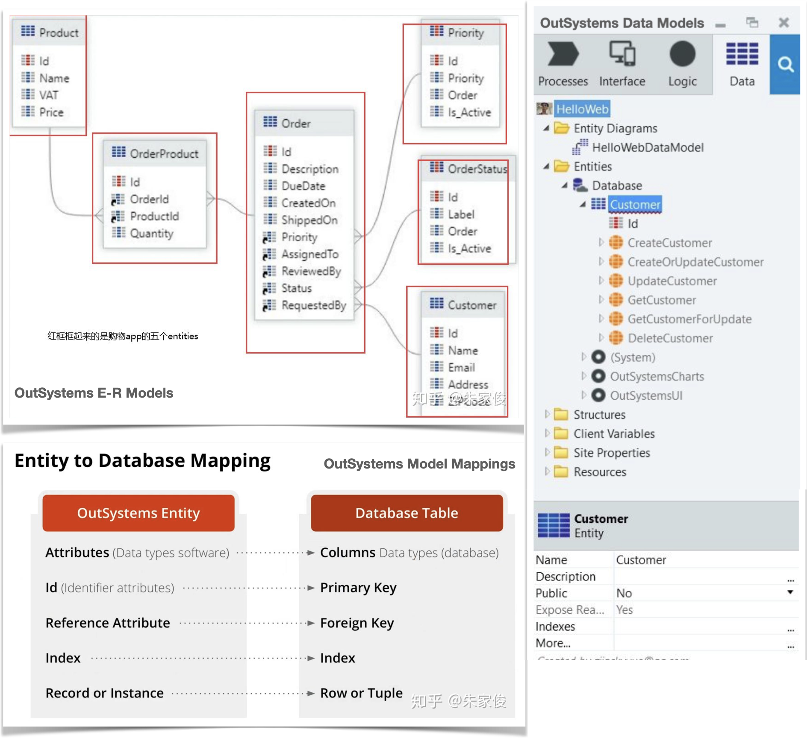
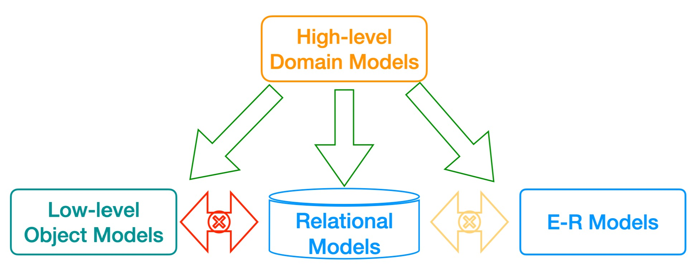
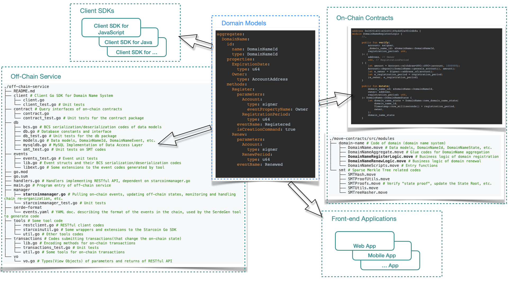
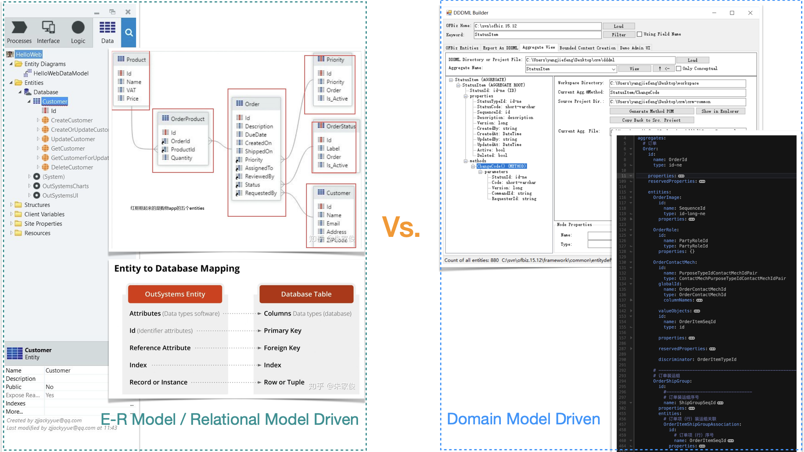
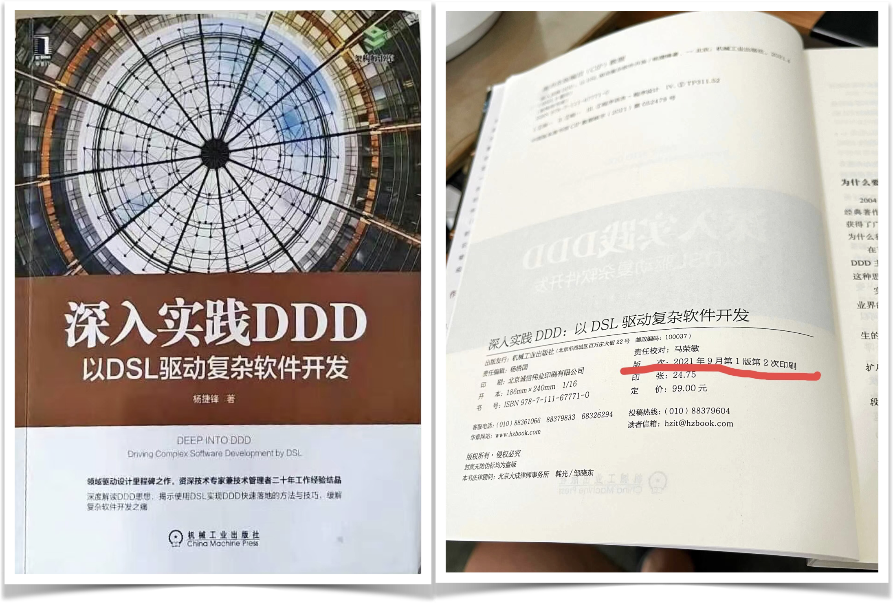

# dddappp：领域驱动的去中心化应用低代码开发平台

[English](README.md) | 中文

## 我们的愿景

我们的目标是打造一个真正的低代码开发平台（Low-Code Development Platform，LCDP），让开发者能够轻松地构建高度复杂的去中心化应用（Dapp）。

我们希望通过低代码开发平台，让开发者能够充分利用去中心化技术基础设施的优势，而不需要关心底层的技术细节。

我们的平台既适应当前的需求，也展望未来的可能。开发者无需受限于特定的编程语言或区块链平台，只需专注于实现“业务逻辑”。这样，无论是复杂的“传统”企业软件还是 Web2 互联网应用，都能轻松地转变为去中心化的  Web3 应用。

### 何谓“真正的”低代码开发平台

事实上，对于什么是低代码开发平台，在业界已经形成了比较统一的评价标准。

如果你认为“低代码”就是“人类编写的代码量越低越好、最好是不需要写任何代码”，或者以为“最好的低代码平台就是无代码平台”，那你就大错特错了。

在这里我们需要特别澄清一个常见的误区，那就是人们对“低代码”和“无代码”的概念混淆。

* “无代码”指的是一大类（没有统一标准的）面向“最终用户”（即非技术人员）的工具。它们可以让用户通过拖拽、选择、填空等简单的操作来创建一些简单应用，比如商品广告页、在线调查表、个人博客等。

* “低代码”开发平台则是面向**专业开发人员**提供服务的工具。它们可以让开发人员利用模型驱动、可视化界面、预定义组件、自动化流程等功能来构建更复杂和强大的应用。

我们认为（其实也是业界公认），一个真正的低代码开发平台应该具备以下几个关键特性：

* **模型驱动**开发。这意味着开发人员可以使用一种更接近“业务”而非“技术”的“领域模型”来描述他们想要构建的应用。这样可以大大降低沟通成本和理解难度，提高协作效率。

* **可视化开发**。这意味着开发人员可以使用一些可视化建模工具来创建和修改领域模型，而不需要编写复杂的代码。还有，我们认为，领域模型理应可以保存为人类可读的纯文本文件。如果开发者觉得有必要，可以直接编辑它们。也就是说，这些文件需要遵循一种 DSL（领域专用语言）的规范。

* 支持**表达式语言**的使用。这意味着开发人员可以使用一种比通用编程语言更简单和易于编写业务逻辑的表达式语言。这种语言应该是函数式和声明式的，即只需要表达“想要什么”，而不需要指定“怎么做”。

* **系统的软件工程支持**。这意味着低代码开发平台应该集成开发、调试、测试、版本控制、DevOps 等软件工程领域的最佳实践，让开发人员可以更专注于应用的功能和质量，而不需要担心技术细节和运维问题。

* **开放集成并且可扩展**。这意味着低代码开发平台应该提供开放的 API，让开发人员可以使用外部的服务和数据，也可以让外部的应用和系统使用低代码开发平台构建的应用。同时，低代码开发平台也应该允许开发人员使用通用编程语言进行扩展，以满足一些特殊的需求。

我们相信，这样一个“真正的”低代码开发平台在去中心化世界中还没有出现，我们有信心和能力去创造它。

## 我们的价值

我们坚信，低代码开发平台是区块链应用开发的未来趋势。它可以让开发者无需关注底层的技术细节，就能快速和方便地构建出高品质的 Dapp。它也可以让更多的“传统”应用开发者涉足区块链领域，利用他们在各个行业和领域积累的知识和经验，创造出更多有价值和有意义的 Dapp。

在初始阶段，我们的低代码开发平台将首先支持基于 Move 平台的 Dapp 开发。

### 为什么我们从 Move 语言开始

我们热爱区块链技术，尤其是 Move 语言带来的“面向资源编程”的革命性创新。我们认为资源的可组合性可以大大加速 Move 生态的创新，从而催生出一些在其他区块链上难以实现的杀手级应用。

但是我们也意识到了区块链应用开发中仍然存在很多挑战和痛点。即使使用了 Move 语言，要开发一个稍微复杂一点的 Dapp，仍然需要花费大量的时间和精力，而且还需要掌握不同的技术栈和工具。这就是为什么我们要打造一个低代码开发平台，让 Move 应用开发变得更加简单和高效。

### 为 DAO 提供支持

我们特别想要强调的是，低代码开发平台与 DAO（去中心化自治组织）结合所产生的巨大想象空间。DAO 是一种存在于区块链世界的“法人”，它可以实现一些传统组织难以达到的效率和透明度。显然，DAO 需要将更多的“业务活动”上链，这就需要更多的区块链“业务软件”的支持。低代码开发平台可以让 DAO 的创建者和参与者更容易地构建出符合他们需求和愿景的 Dapp，并且可以随时进行修改和优化。

传统的低代码开发平台已经证明了它们在快速开发传统的“企业级应用”方面的优势，我们相信在  Web3 时代也会如此。

## Web3 低代码开发现状

如果按照上述标准来衡量传统的 Web2 时代的企业应用低代码开发平台，我们可以看到一些相对优秀的领导者，比如 OutSystems、Mendix、Salesforce 等。

那么，在  Web3 时代，是否有一些同样优秀的 Dapp 低代码开发平台呢？

遗憾的是，按照上述严格的“真正的”低代码标准来看，我们还没有看到这样一个 Dapp 低代码开发平台的出现……

> 为什么这么难？为什么他们做不到？

### 企业应用低代码平台的“模型驱动”

传统企业软件开发平台（包括低代码平台）基本都是采用 ER（实体关系）模型 and/or 关系模型（SQL 数据库采用的模型）来“驱动”开发。

比如，看看 OutSystems 怎么做的？

OutSystems 既使用了 ER 模型也使用了关系（数据）模型（有的企业软件开发平台只使用其中的一种）。

ER 模型和关系模型使用的概念之间有很直接的对应关系，所以它们的建模结果（产生的代码）很容易跑在传统的企业软件技术基础设施——SQL 数据库上。但是它们很难跑在区块链这样的全新的技术基础设施上——主流的智能合约平台的“去中心化账本”的构造和传统的 SQL 数据库实在相差太远。

显然，开发一个“真正的”低代码平台需要长期的技术和经验的积累，而传统企业应用低代码平台所采用的技术路线，导致它们很难被移植到 Dapp 开发这个全新的领域。

至于已有的 Dapp “低代码”平台，你可能会问：“它们是没有这些特性，但是这又有什么关系？”

### 核心价值观的重要性

开发一个真正的低代码平台——尤其是坚持“模型驱动”——无疑是一条艰难的路。在我们看来，已有的 Dapp“低代码”平台之所以难称成功，是因为他们总想“走捷径”。

> 不忘初心，方得始终。

我们认为，一个平台的潜力是由它的“内核”决定的。专业低代码平台所应具备的核心特性，比如模型驱动、表达式语言，都具有其他试图“绕过”的解决方案难以替代的价值。

比如说，“可配置的智能合约模板”当然也有它的价值，就是提升了开发人员拷贝、粘贴、修改“现成代码”的效率——前提是确实存在“现成代码”。如果开发者想要做一些创新性的应用，没有现成的“智能合约模板”可用，那么它就没法帮助到开发者；需要支持“多链”时，平台方开发人员编写和维护这样的“智能合约模板”库也是很大的负担，需要使用不同的语言（Solidity、Move 等）为不同的链编写不同的模板。“智能合约”往往只是应用的链上（On-Chain）部分，去中心化应用往往还需要链下（Off-Chain）部分的开发。

还有“表达式语言”，虽然想要较完美地实现这个特性可能是复杂的（即使我们的平台想要实现它，优先级可能也比较低）——我们需要开发编译器将以这种表达式语言编写的代码编译为各个链的虚拟机（EVM、MoveVM 等）可以执行的指令，但是有了它，开发者就可以仅使用这门“表达式语言”编写业务逻辑，开发出来的应用直接可以运行在不同的链上。不需要去学习和使用各个链的开发语言，这大大节约了应用的开发和移植成本。

## 我们的技术

我们的低代码开发平台最核心的特性是“模型驱动开发”。当然，它也是所有“合格的”低代码开发平台所应该具备的核心特性。

### 以领域模型为核心

关键是建模范式！

有别于传统的企业应用低代码平台通常采用关系模型以及/或者 ER 模型，我们的平台采用 DDD（[Domain-Driven Design](https://en.wikipedia.org/wiki/Domain-driven_design)）风格的领域模型，这是我们的平台如此独特和强大的根本原因。

DDD 领域模型是一种抽象层次较高的 OO（面向对象）模型，可以很容易地映射到编程语言对象模型、关系模型等抽象层次较低的模型；而低层次模型之间的相互映射则相对困难，往往需要开发人员介入甚至编写大量的实现代码。

为了构建领域模型，我们需要一种领域建模语言。这种语言必须满足以下要求：

* 可以精确地表达领域中的关键概念和规则。
* 使用它构建的模型可以作为整个应用开发团队（包括技术人员和领域专家）沟通的基础。这可以极大提高交流的效率和质量。
* 可以很方便地将领域模型映射到应用的代码实现，极大地减少编码的工作量和出错的风险。
* 支持多种编程语言和技术平台。
* 是一种 DSL（领域特定语言），既可以被可视化工具采用，也方便人类阅读和编写。

问题是，我们是否可以找到一种符合上述要求的语言？

幸运的是，我们已经找到了它。更确切地说，是我们发明了它。

### 领域驱动设计建模语言（DDDML）

DDDML（领域驱动设计建模语言）我们发明的一种 DDD 原生的 DSL。它可以让你用一种简洁、清晰、自然的方式来描述你的领域模型。

DDD 的创始人 Eric Evans 曾经说过，他一直深信 DSL 会是领域驱动设计发展的下一大步。

DDDML（领域驱动设计建模语言）迈出了这坚实的“一大步”。

有了 DDDML 描述的领域模型，我们就可以构建一个工具链，从模型生成应用的各个部分的代码，然后在各种技术基础设施上运行应用。

## 我们的团队

> 你们选择了一条其他 Dapp 低代码平台都不敢尝试的路……虽然理论上你说的都对，可是你们有什么底气做到？

因为，“使用 DDD 风格的领域模型驱动开发”，这是我们在 Web2 时代亲身实践过的事情！

在那个时候，我们就已经不满足于实现一个“传统的”低代码开发平台，我们要用 DDD 风格的领域模型来驱动新型企业应用（SaaS）以及互联网应用的开发，这是一个非常大胆和创新的尝试。但是这个路子是通的，我们有过很多宝贵的经验积累。我们甚至出版了一本厚厚的专著来向开发人员分享其中经验。

我们项目的架构师是杨捷锋。他有超过二十年的软件开发经验，DDD 专家，DDDML 的创造者，技术图书[《深入实践 DDD：以 DSL 驱动复杂软件开发》](https://item.jd.com/12834017.html)的作者。

正是在《深入实践 DDD》一书中，我们详细阐述了 DDDML 这一 DDD 原生 DSL 及其相关开发工具链的设计，以及如何使用它们解决复杂软件开发过程中的各种痛点。该书于 2021 年 4 月出版，当年 9 月重印，广受好评。

也就是说，早在 Web2 时代，我们就完成了这个低代码平台的关键技术理论体系的构建，并将其成功付诸于实践。

除此之外，杨捷锋还是第一个 Move 公链 Starcoin 上几个重要的生态基础项目的开发者，或者为它们提供了关键技术支持。

开发者都知道 dictionary / hash table 是应用开发时常常会用到的一种数据结构（在 Solidity 中类似的数据结构叫做 `mapping`）。在 Move 的 stdlib 以及 Starcoin Framework 还没有 `Table` 的时候，我们在开发 Starcoin 应用时需要使用一些方法来“绕过”这个限制，比如可以采用链下 SMT（稀疏梅克尔树）+ 链上 Root 哈希的解决方案。这样的方案在编程实现上可能相当繁琐，但是使用低代码的开发方式，我们可以向应用开发者屏蔽很大一部分（因为技术基础设施的限制带来的）复杂性。见[这个链接](./a-starcoin-demo-app-CN.md)中的探讨。

## 我们的产品

我们的低代码开发平台叫做 dddappp，它是  **Domain-Driven DAPP low-code Platform** 的缩写，意思是“领域驱动的去中心化应用低代码（开发）平台”。

我们已经基于 Sui、Rooch 以及 Aptos 这三个知名的 Move 智能合约平台，实现了 MVP（最小可行产品）。

> 🎉 本项目是获得 Sui 基金会的第一轮 grant 的项目之一（列表中的第一个）：https://sui.io/resources-sui/sui-foundation-round-1-awardees/ 🎉

这意味着，你现在就可以使用我们提供的 dddapp CLI 工具，来开发基于 Sui、Rooch 以及 Aptos 的去中心化应用！

只需按照下面这些链接的指引，你就可以体验“模型驱动”的强大威力！

* [使用 dddappp 低代码工具开发 Sui 去中心化应用](https://github.com/dddappp/A-Sui-Demo/blob/main/README_CN.md)
* [使用 dddappp 低代码工具开发 Rooch 去中心化应用](https://github.com/dddappp/A-Rooch-Demo/blob/main/README_CN.md)
* [使用 dddappp 低代码工具开发 Aptos 去中心化应用](https://github.com/dddappp/A-Aptos-Demo/blob/main/README.md)。
* [在 Sui 上低代码开发一个 Blog 示例应用](https://github.com/dddappp/sui-blog-example)。开发者只需要写大约 30 行代码（这些代码都是领域模型的描述），然后一键生成一个仿 [RoR Getting Started](https://guides.rubyonrails.org/getting_started.html) 的 blog 示例应用，不需要编写一行（除了领域模型之外的其他）代码。
* [在 Rooch 上低代码开发一个 Blog 示例应用](https://github.com/rooch-network/rooch/blob/main/examples/blog/README.md)。Blog 示例的 Rooch 版本。
* [在 Aptos 上低代码开发一个 Blog 示例应用](https://github.com/dddappp/aptos-blog-example)。Blog 示例的 Aptos 版本。

## 我们的路线图

这是一个具有挑战性和前瞻性的项目，我们将分阶段实现我们的愿景。

### 第一阶段

我们需要开发一个命令行工具或者工具集，可以帮助开发者根据领域模型自动生成链上的 Move 合约（Dapp 的链上部分）和链下服务（使用 Java 语言）。

我们已经成功地完成了第一阶段的工作。

### 第二阶段

我们将把第一阶段开发的命令行工具或者工具集迁移到云端，提供一个简洁易用的 Cloud IDE，让开发者可以在浏览器中编写领域模型代码、一键生成和部署 Dapp 应用，并提供测试环境和调试工具。

【TBD】

